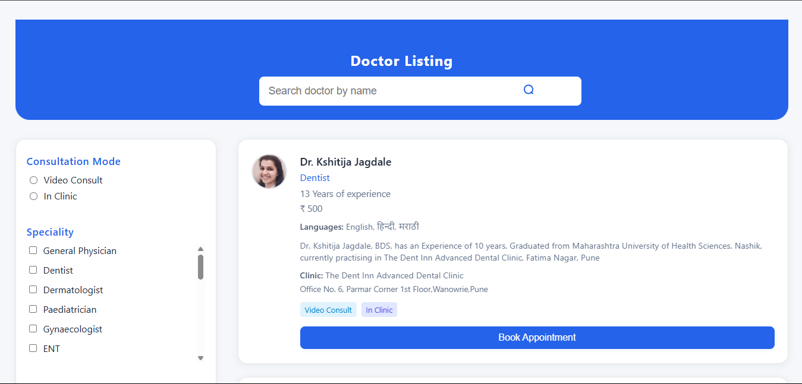

# 🚀 [Doctor Listing App (Live Demo)](https://doctor-listing-app-rust.vercel.app/?)

---

## Doctor Listing App

This is a modern, responsive Doctor Listing web application built with React.  
**It was developed as part of the Bajaj interview process.**

---

## Features

- **Autocomplete Search:** Search doctors by name with instant suggestions.
- **Filter Panel:**
  - **Consultation Type:** Filter by Video Consult or In Clinic.
  - **Speciality:** Multi-select from a list of medical specialties.
  - **Sort Options:** Sort doctors by Fees (Low to High) or Experience (High to Low).
- **Doctor Details:** Each card shows the doctor's name, specialties, experience, fees, languages spoken, introduction, clinic details, and available consultation modes.
- **Responsive UI:** Clean, minimal, and mobile-friendly design.
- **URL Query Sync:** Filters and search state are reflected in the URL for easy sharing and navigation.
- **Frontend Only:** All filtering, searching, and sorting are performed client-side after the initial API call.

---

## Screenshots

---

## Tech Stack

- [React](https://reactjs.org/) (with functional components and hooks)
- [Vercel](https://vercel.com/) for deployment
- [Netlify](https://www.netlify.com/) and [GitHub Pages](https://pages.github.com/) compatible
- Fetches doctor data from a public [JSON API](https://srijandubey.github.io/campus-api-mock/SRM-C1-25.json)

---

## How to Run Locally

1. **Clone the repository:**
git clone https://github.com/yourusername/doctor-listing-app.git
cd doctor-listing-app

text

2. **Install dependencies:**
npm install

text

3. **Start the development server:**
npm start

text
The app will open at [http://localhost:3000](http://localhost:3000).

---

## How to Deploy

This app is already deployed at:  
**[https://doctor-listing-app-rust.vercel.app/?](https://doctor-listing-app-rust.vercel.app/?)**

To deploy your own version:
- Push your code to GitHub.
- Go to [Vercel](https://vercel.com/), import your repo, and click "Deploy".

---

## About

This project was created by Nipun as part of the **Bajaj interview process**.

---
